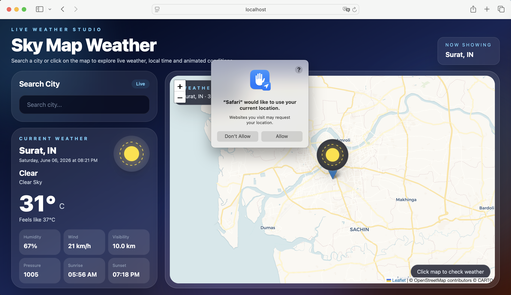
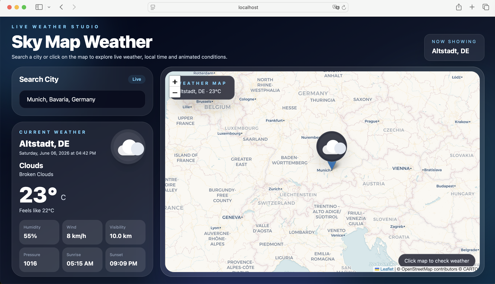
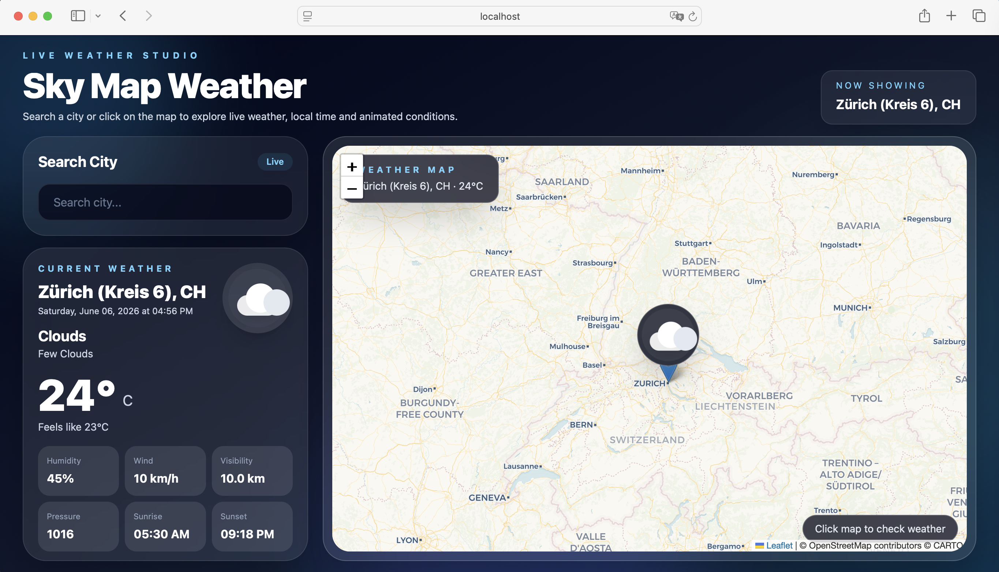

<p align="center">
  
</p>

# Sky Map Weather

Sky Map Weather is a modern React weather application that allows users to search for any city or click directly on the map to view live weather information.

The app shows current weather, local city time, temperature, humidity, wind speed, visibility, pressure, sunrise, sunset, and an animated weather icon on the map.

## Features

- Live weather data using OpenWeather API
- City search suggestions using OpenStreetMap Nominatim
- Interactive map using React Leaflet
- Click on the map to get weather for that location
- Current location weather support
- Animated weather icons for clear, cloudy, rainy, snowy, haze, and thunderstorm conditions
- Local date and time for the selected city
- Modern responsive UI using Tailwind CSS
- Built with React Hooks: useState, useEffect, and useRef

## Tech Stack

- React
- Vite
- Tailwind CSS
- React Leaflet
- Leaflet
- OpenWeather API
- OpenStreetMap / Nominatim

## Screenshots

### Home View



### City Search



### Interactive Weather Map



## Environment Variables

This project requires an OpenWeather API key.

Create a `.env` file in the root folder and add:

```env
VITE_OPENWEATHER_API_KEY=your_openweather_api_key_here